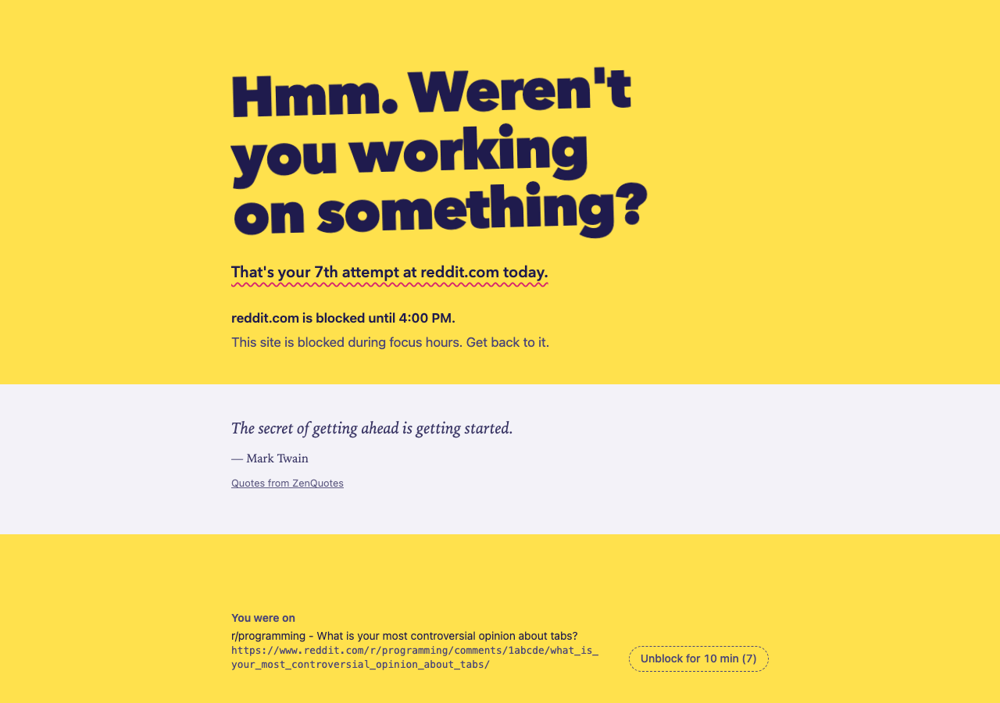
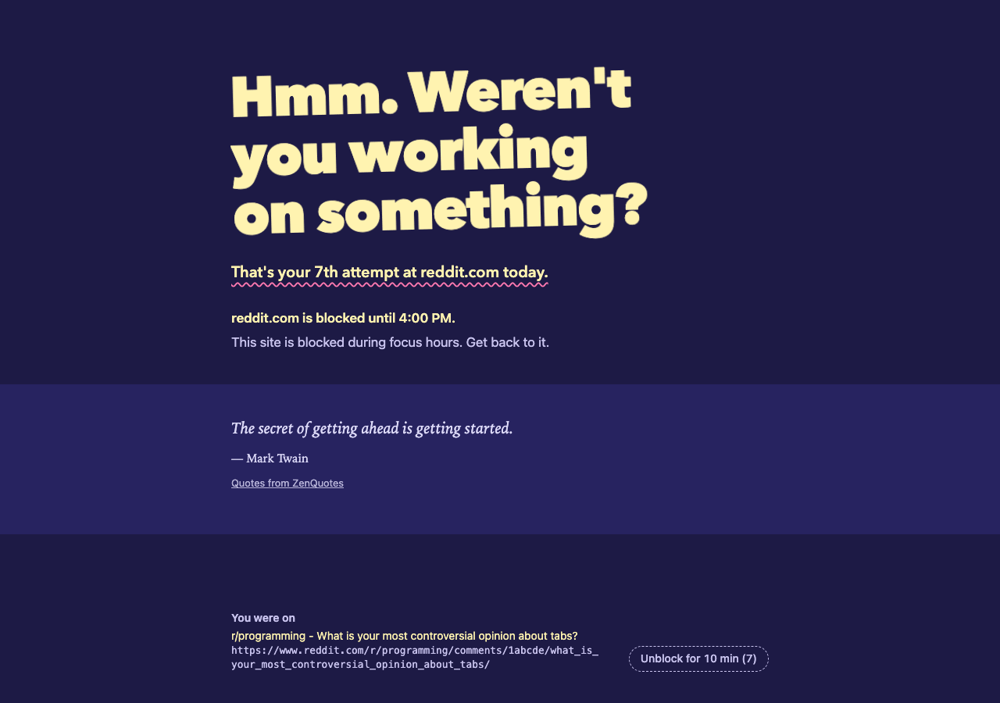
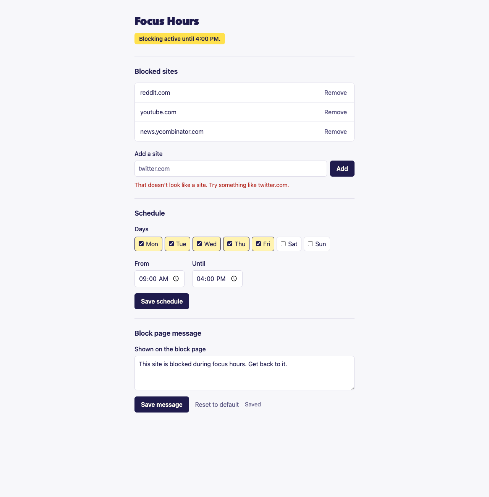

# Focus Hours

A Chrome extension that blocks distracting sites on a schedule. By default it blocks Reddit and YouTube from 10:00 to 16:00, Monday to Friday. You can change the sites, days, hours and message.



## Features

- **Scheduled blocking.** One weekly schedule (days plus a start and end time, in local time) applies to every site on your list. A site also covers its subdomains, so `reddit.com` blocks `old.reddit.com` too.
- **Open tabs are caught.** When a block starts, tabs already on a blocked site switch to the block page, which shows the title and address of the page you were on. When the block ends, those tabs go back to that page (reloaded).
- **A block page with some attitude.** It shows a random snarky headline, your own message, a count of how many times you've tried the site today, and a productivity quote.
- **Search results can still get through.** Tick "from search" for a site and a link you click in Google, Bing or DuckDuckGo opens. You stay in the section you landed in — that subreddit, or that one video — and the rest of the site stays blocked. Typing the address yourself is still blocked.
- **A slow escape hatch.** The unblock button counts down 10 seconds before it can be clicked. The countdown only runs while the tab is visible. Unblocking lifts the block on that one site for 10 minutes, then it comes back.
- **Light and dark themes** that follow your system setting.

| Block page (dark) | Settings |
|---|---|
|  |  |

## Install

Focus Hours isn't on the Chrome Web Store. Load it unpacked:

1. Clone or download this repository.
2. Open `chrome://extensions` and turn on **Developer mode** (top right).
3. Click **Load unpacked** and select the repository folder (the one containing `manifest.json`).
4. Click the Focus Hours toolbar icon to open the settings.

Requires Chrome 108 or later (or another Chromium browser with Manifest V3 support).

## Usage

On the settings page you can:

- **Add or remove sites.** Paste a full URL or just the domain. `https://www.Reddit.com/r/foo` becomes `reddit.com`.
- **Allow search results per site.** Each site has a "from search" checkbox, so you can let Reddit threads through while YouTube stays shut.
- **Set the schedule:** which days, plus a start and end time. The window can't cross midnight.
- **Edit the block page message,** or reset it to the default.

Changes take effect immediately, with no reload needed.

## Privacy

- Your settings, unblock timers and daily attempt counts are stored locally in `chrome.storage.local`. Nothing is synced or sent anywhere.
- To show a quote, the block page requests a random quote from [ZenQuotes](https://zenquotes.io/) each time it loads. ZenQuotes sees an ordinary request from your browser but not which site was blocked. If the request fails or takes longer than 1.5 seconds, a bundled quote is shown instead.
- No analytics, no tracking, and no other network requests.

### Permissions

| Permission | Why |
|---|---|
| `declarativeNetRequest` | Redirect blocked sites to the block page before they load |
| `tabs` | Find open tabs on a blocked site when a block starts, and restore them when it ends |
| `webNavigation` | Notice when a page opened from a search wanders out of its section, on sites that switch pages without a reload |
| `alarms` | Wake up exactly when the schedule starts or ends, or an unblock expires |
| `storage` | Save your settings |
| Host access to all sites | Needed to redirect any site you choose to block, and to fetch the quote |

## How it works

Everything runs through one function in the service worker, `sync()`. It runs whenever settings change, an alarm fires, or the browser starts. Each run it:

1. works out which sites should be blocked right now (schedule minus active unblocks),
2. replaces the `declarativeNetRequest` redirect rules to match,
3. sends open tabs on blocked sites to the block page, and returns tabs whose site is no longer blocked,
4. sets a single alarm for the next moment anything can change.

When a site allows search results, a higher-priority rule lets page loads through whose initiator is a search engine. The service worker then gives that tab a pass covering the section the page landed in: the first two path segments of the URL, such as `/r/programming`. A URL with no section, like `/watch?v=abc`, covers that one page.

A pass is a second rule, scoped to that tab and that section, so reloads and ordinary link clicks inside the section work as well. Everything else on the site is still blocked, and because Reddit and YouTube change pages without a page load, the worker also watches history navigations and blocks the moment you leave the section. A pass ends when you leave the section, when the tab closes, and whenever the settings or the schedule change — including at the start of a blocking window.

Pages that never meet the rules at all — one restored with the Back button, or a tab reopened at startup — are checked against the same test and blocked if they don't hold a pass.

Each run is recomputed from storage and the current time, so a missed alarm (for example, while the computer was asleep) sorts itself out on the next run.

```
src/
  schedule.js      when blocking is active, and the next time that changes
  domains.js       domain cleanup and subdomain matching
  enforcement.js   what to block, which rules to write, which tabs to move
  blockedUrl.js    the block page URL format
  attempts.js      daily per-site attempt counter
  searchPass.js    search engines, and the section a search-opened page covers
  content.js       headlines and fallback quotes
  quote.js         ZenQuotes fetch with timeout and fallback
  storage.js       settings, unblocks and attempts in chrome.storage.local
  background.js    service worker: wires the above to Chrome APIs
  blocked/         block page
  options/         settings page
```

## Development

There's no build step and no dependencies. The logic modules are plain ES modules with unit tests using Node's built-in test runner (Node 20+):

```sh
npm test
```

To try the extension, load it unpacked (see [Install](#install)). After changing code, click the reload icon on the extension's card in `chrome://extensions`.

To test a block without waiting for 10 AM, set the schedule to start a minute from now.

## Limitations

- One schedule for all sites. Per-site schedules aren't supported.
- A section is the first two path segments, which suits forums and video sites. On a site whose URLs look like `/2026/09/article`, a search pass covers that whole month.
- Search links are recognized by a fixed list of search hosts, so a niche engine won't be treated as one.
- Reloading a page that has no section, such as a YouTube video opened from a search, blocks it again. The section rule needs a path to match on.
- Restored tabs reload their page, so the video position, scroll position and any form input are lost.

## License

[MIT](LICENSE)
